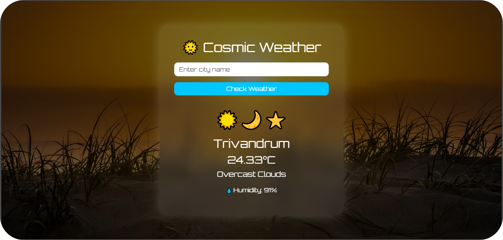

☀️🌙 Cosmic Weather App

A stunning weather forecast app built with **Python Flask**, featuring a **cosmic-themed background** with stars, sun, moon, and rainy vibes. It fetches real-time weather data using the **OpenWeatherMap API** and provides temperature, humidity, and weather descriptions for any city.

🚀 Features

- 🌆 Search weather by city
- 🌡️ Displays temperature, humidity, and description
- 🌌 Beautiful cosmic UI (sun, moon, stars, rain)
- 💨 Real-time weather using [OpenWeatherMap API](https://openweathermap.org/)
- 📱 Responsive and mobile-friendly design

🖼️ Screenshots

 


🛠️ Tech Stack

- **Backend**    : Python 3, Flask  
- **Frontend**   : HTML5, CSS3, Bootstrap  
- **API**        : OpenWeatherMap  
- **Deployment** : (optional)

📦 Installation

1. **Clone the repo**
   ```bash
   git clone https://github.com/your-username/Cosmic-Weather-App.git
   cd Cosmic-Weather-App

2. **Install requirements**

pip install -r requirements.txt
Create a .env file
Place your -> API_KEY=your_openweathermap_api_key

3. **Run**
python app.py
Open your browser:

http://127.0.0.1:5000


🔑 How to Get an API Key
Visit: https://openweathermap.org/api

Create an account → Login → Go to "API keys"

Generate and copy your API key

Paste it in your .env file like:

API_KEY=your_actual_key_here
